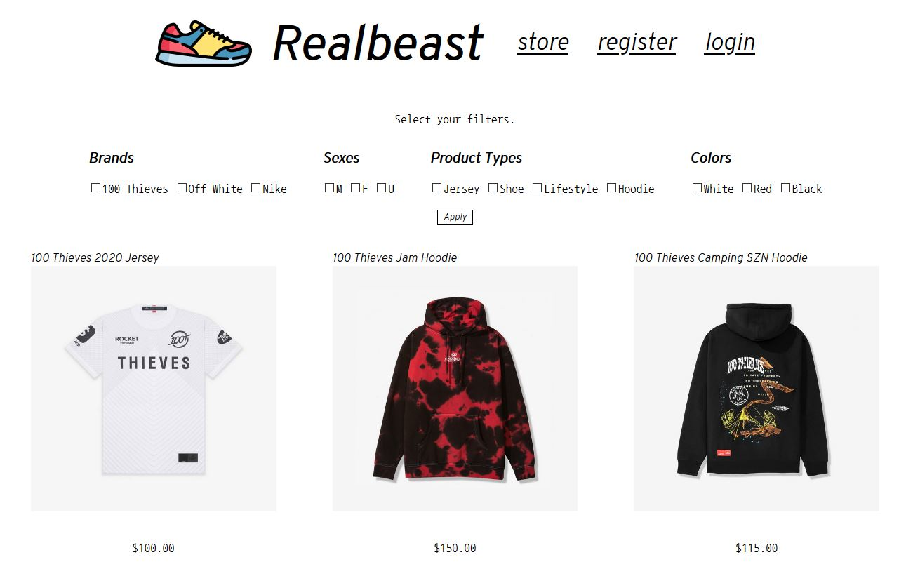

# databases

My group's term project for CPSC 471, the database management systems course at UofC. 

This project uses a SQLite database so that we can coordinate it with the repo of the project. 

If you are completely new to Django / Web Dev, I would recommend following the tutorial at the Django documentation to see how it all fits together. 

Otherwise, there is a rather good amount of inline documentation. 

# Quickstart guide :rocket:

## Install some dependencies

To run our project, you will need Python - it was developed on Python 3.8. 

- Install django: `python -m pip install Django` 
- Install django REST framework: `pip install djangorestframework` and `pip install markdown`

Clone this repository to your computer.

To run the server locally, navigate to `realbeast/mysite` folder from the top repository directory, and run: 

`python manage.py runserver`

Then, you can open up http://127.0.0.1:8000/ in your browser - welcome to our website! :rocket:

## Using the quickstart

Only registered users can access their cart and place orders.

Sign into admin by navigating to the login page, enter:

- Username: `admin`
- Password: `12345`

From here, you can either do some shopping, update item information and more. The bulk of our time was spent getting our API operational, so the front-end isn't feature complete just yet. 

If you instead want the experience from a customer's point of view, sign out of the admin user and register at the bottom of the homepage. 

# Our REST API :whale2:

Our Postman API is complete and professional, included in the root folder of this repo- import the `RealbeastAPI.postman_collection.json` file in Postman, and you are set! :rocket:

The documentation for everything involved with that is accessible through Postman. 

All you need to do is boot up the local server as instructed above, and all of the requests in it should work flawlessly. :tada:

# To do list (web interface) :zap:
- creating base HTML documents for pages (with navbar) that we can extend to make more pages easier :heavy_check_mark: (See realbeast/templates/base.html)
- add user registration, sign in and account management pages :heavy_check_mark:
- add store page and product view pages :heavy_check_mark:
- added filtering on store page :heavy_check_mark:
- added page for updating product information (quantities, description, titles, etc)  :heavy_check_mark:
- implement Django REST to get desired API functionality (see Our REST API) :heavy_check_mark:
- fixed bugs found during presentation  :heavy_check_mark:

### References: 

- Icons used in the website are from Flaticon
- 100 Thieves apparel images are copyright of 100 Thieves
- Nike apparel images are copyright of Nike

